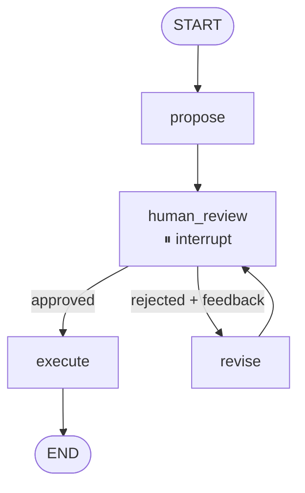

# 03 · Human-in-the-Loop (HITL)

The agent proposes an action and **pauses** — execution resumes only when a human approves (or supplies feedback to revise). LangGraph's `interrupt()` + a checkpointer make the pause durable: your caller can be a web request, a Slack bot, or a CLI prompt.



---

## When to use this

- An action has **real-world side effects** (sends mail, spends money, changes prod state).
- You need an **audit trail** of who approved what and why.
- The action is **reversible but expensive to reverse** — cheaper to gate than to roll back.

## When *not* to use it

- The decision is **routine and well-specified**. Gate on rules, not a human.
- Latency matters more than correctness (no human = no wait).
- You can't persist state between the pause and the resume (serverless without external store, etc.). HITL needs a real checkpointer.

---

## The contract

```python
class State(TypedDict):
    request: str          # what the user asked for
    proposal: str         # current proposed action
    rationale: str        # why the agent chose this
    approved: bool        # set by the human
    human_feedback: str   # free-text feedback on rejection
    final: str            # action actually executed
```

The `interrupt()` call inside `human_review` surfaces `{proposal, rationale}` to the caller. Resume with `Command(resume={"approved": ..., "feedback": ...})`.

---

## Tradeoffs

| Choice | Why | Alternative |
|--------|-----|-------------|
| **`InMemorySaver` checkpointer** | Simplest setup for a demo | `SqliteSaver` / `PostgresSaver` for production durability |
| **Interrupt surfaces proposal + rationale** | Human has full context to decide | Bare proposal → human must infer intent |
| **Revise loops back to same review node** | Reviewer sees each revision | Single-shot review → rejected = dead |
| **Explicit `approved: bool`** rather than parsing free-text | Unambiguous dispatch | Free-text → regex-matching approval words, fragile |

---

## Production notes

- **Persist `thread_id` with the business entity** (e.g., ticket ID, PR number) — that's how you resume the right interrupt later.
- **Bound the revision loop.** Add a `revisions: int` counter and `max_revisions` guard — otherwise a stubborn reviewer + stubborn agent loop forever.
- **Log every interrupt/resume event.** That record *is* your approval audit trail.
- **Choose a durable checkpointer.** `InMemorySaver` loses state on process restart. Use `PostgresSaver` or similar in production.
- **Timeout awaiting review.** Decide in advance whether a stale pending proposal should auto-reject, escalate, or stay open forever — and encode it.

---

## Run it

```bash
export ANTHROPIC_API_KEY=...
python -m patterns.hitl.example
```
