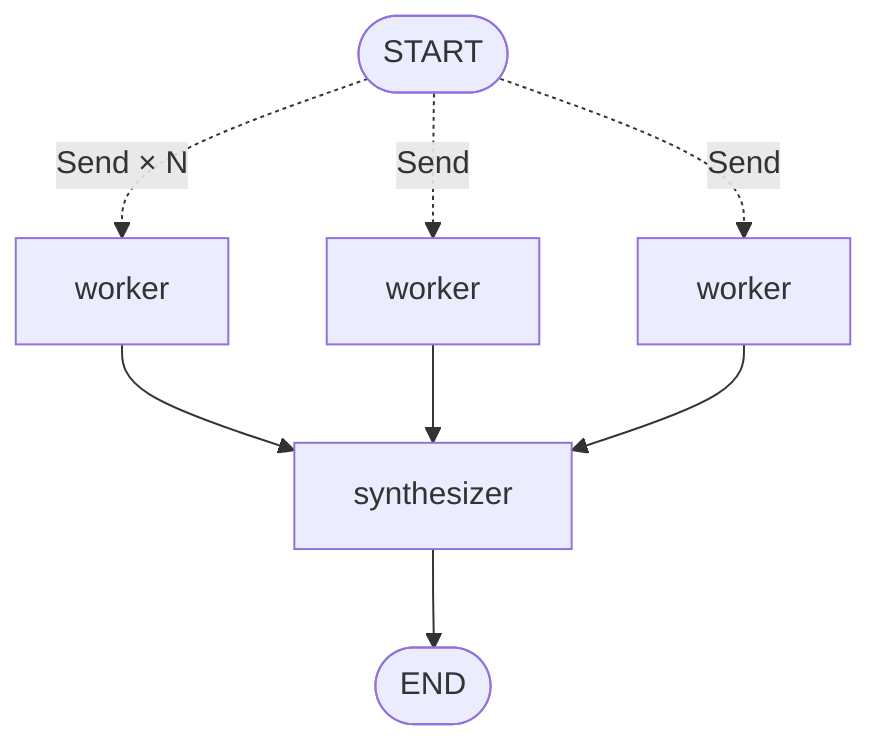

# 05 · Map-Reduce (Fan-out / Fan-in)

Dispatch N independent subtasks in **parallel**, then fold their outputs into a single result. LangGraph's `Send` API + an `Annotated[list, operator.add]` reducer make this the right shape for embarrassingly parallel LLM work.



---

## When to use this

- You have **N items that can each be processed independently** (documents, files, records).
- Per-item latency is dominated by LLM calls, and running them sequentially is wasteful.
- The synthesis step can work from **per-item summaries** — you don't need every worker's full output in every other worker's context.

## When *not* to use it

- Items **depend on each other**. Use Plan-Execute.
- The "reduce" step needs the full content of all items — you're probably just doing a big prompt; skip the map phase.
- N is unbounded and you don't control it. You'll drown in concurrent API calls. Add a concurrency cap (see production notes).

---

## The contract

```python
class State(TypedDict):
    theme: str
    items: list[str]
    findings: Annotated[list[str], operator.add]  # reducer concatenates
    synthesis: str
```

The `Annotated[..., operator.add]` is the key trick: each worker returns `{"findings": [one_result]}` and LangGraph appends them into a single list.

---

## Tradeoffs

| Choice | Why | Alternative |
|--------|-----|-------------|
| **`Send` API for fan-out** | True parallelism inside LangGraph | Sequential loop → N × latency |
| **`operator.add` reducer** | Built-in, zero ceremony | Custom reducer → only needed for dedup / merge |
| **Workers don't see each other's output** | Isolation = real parallelism | Cross-talk → you've re-invented Plan-Execute |
| **Explicit synthesizer node** | Final structure can be prompted | Just return the list → caller does the work |

---

## Production notes

- **Cap concurrency.** `graph.invoke(..., {"max_concurrency": 5})` prevents N=200 from nuking your rate limits and wallet.
- **Batch small items first.** If each worker call is tiny, bundle multiple items per `Send`. Parallel overhead isn't free.
- **Handle partial failures.** One worker failing shouldn't kill the batch. Wrap workers in try/except and return a structured "failed" marker; synthesizer can skip or flag them.
- **Log the fan-out width.** `len(items)` per run is your cost multiplier — alert on outliers.
- **Consider `Send` payload size.** Everything you send to a worker is copied — keep payloads lean, use references (IDs) for large objects.

---

## Run it

```bash
export ANTHROPIC_API_KEY=...
python -m patterns.map_reduce.example
```
