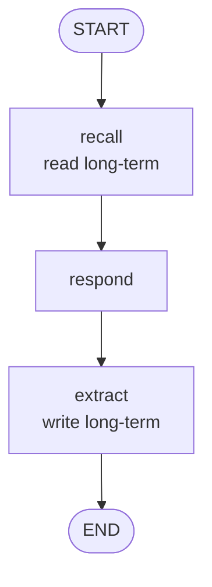

# 06 · Memory (Short + Long Term)

Two memory tiers with a clear contract between them:

- **Short-term** — the current conversation, lives in graph state, gone when the session ends.
- **Long-term** — durable facts about the user, lives in an external store, survives across sessions.

A **recall** node pulls relevant long-term facts into the prompt. An **extract** node writes new durable facts back after each turn.



---

## When to use this

- The assistant needs to **remember preferences, goals, or constraints** across sessions.
- Short-term chat history alone would cost too much to carry forever.
- You want the two memory tiers to be **inspectable and editable** independently (e.g., "forget that fact").

## When *not* to use it

- Single-session app. Just keep the message list.
- You need **semantic search over documents**, not user facts — that's RAG, a different pattern.
- Privacy/compliance forbids durable user state. Don't add long-term memory then try to hide it.

---

## The contract

```python
class State(TypedDict):
    user_id: str              # partition key for long-term store
    messages: list[Message]   # short-term (this session only)
    recalled: list[str]       # long-term facts loaded for this turn
    response: str
```

The `LongTermMemory` interface exposes only `read(user_id, query, k)` and `write(user_id, fact)` — small enough that swapping for a real vector store is a one-file change.

---

## Tradeoffs

| Choice | Why | Alternative |
|--------|-----|-------------|
| **Two distinct tiers, not a blended buffer** | Different retention, different costs, different privacy | Single chat buffer → grows forever |
| **Recall before respond** | Respond sees retrieved facts in-prompt | Recall after → they're not available for this turn |
| **Extract after respond** | Fact extraction has the whole turn as context | Extract before → misses facts implied by the exchange |
| **Keyword match in demo store** | Trivial to read, zero deps | Vector store → correct in production, overkill here |
| **Extraction as structured output** | Deterministic fact list | Free-text → hard to dedupe, easy to over-write |

---

## Production notes

- **Replace the store.** `LongTermMemory` here is a demo. Swap for `pgvector`, a LangChain `VectorStore`, or a structured knowledge service — the interface stays the same.
- **Deduplicate before writing.** LLMs love to restate the same fact. Embed + cosine-similarity-check before `write()`, or let the store do it.
- **Let the user see and edit.** `/memory view` and `/memory forget` commands are a huge trust win. If users can't see what you remember, they won't trust you to remember it.
- **Bound recall.** `k` too high dilutes the prompt with irrelevant facts. 3-5 is usually right for personal context.
- **Expire stale facts.** Durable ≠ forever. Add a TTL or a recency score when writing.
- **Privacy first.** Mark PII explicitly at write time — it changes storage choices, retention, and deletion obligations.

---

## Run it

```bash
export ANTHROPIC_API_KEY=...
python -m patterns.memory.example
```

## Sample run

```
── Session 1 ──
user: I'm allergic to shellfish, and I'm planning a trip to Lisbon next month.
bot:  That's exciting! Lisbon is a wonderful destination. Since you're
      allergic to shellfish, ... [safe-dining tips for Portugal] ...

Long-term store now holds:
  ['User has a shellfish allergy',
   'User is planning a trip to Lisbon next month']

── Session 2 (later) ──
user: Recommend a restaurant for my trip.
bot:  I'd love to help you find a great restaurant in Lisbon! ... any
      dietary restrictions I should know about besides your shellfish
      allergy? ...
```

In session 2 the user says *"my trip"* with no other context — but the bot knows it's **Lisbon** and remembers the **shellfish allergy**, without the user repeating either. The extract node wrote durable facts after session 1; the recall node surfaced them into session 2's prompt.
