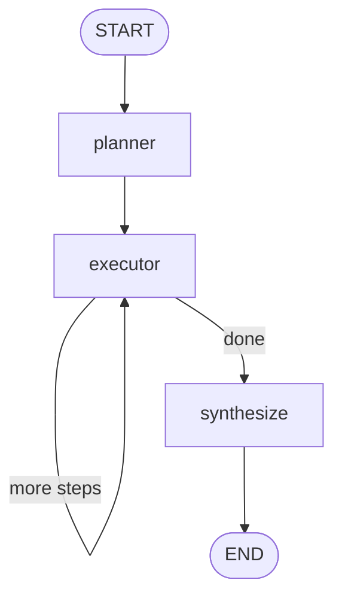

# 04 · Plan → Execute

Separate **planning** from **execution**. A planner node emits an ordered list of steps; an executor works through them one at a time. A final synthesizer folds step outputs into the answer.



---

## When to use this

- The objective is **multi-step** and the steps aren't obvious up-front to a single LLM call.
- You want the **plan itself to be visible** — for review, editing, or replaying.
- Step outputs inform later steps but **not** in ways that require rerouting (if rerouting is needed, use a router inside the executor).

## When *not* to use it

- The task is single-shot. A Plan-Execute with one step is over-engineering.
- Steps are truly independent and can run in parallel → use Map-Reduce instead.
- The plan needs to mutate mid-execution in non-trivial ways. Add a replanner node — or reach for a ReAct-style agent.

---

## The contract

```python
class State(TypedDict):
    objective: str         # user's goal
    plan: list[str]        # emitted by planner
    current_step: int      # pointer into plan
    step_outputs: list[str]  # one per completed step
    final: str             # synthesizer output
```

Invariant: `len(step_outputs) == current_step` at every point after the planner runs.

---

## Tradeoffs

| Choice | Why | Alternative |
|--------|-----|-------------|
| **Plan separated from execution** | Auditable, editable, checkpointable | ReAct-style → faster but opaque |
| **Executor calls itself via conditional edge** | Sequential without recursion | `Send` loop → implicit parallelism you didn't want |
| **Prior steps passed into executor prompt** | Later steps see earlier results | Isolated steps → repetition + lost context |
| **Separate synthesizer** | Final answer has access to full transcript | Last-step-is-answer → brittle |

---

## Production notes

- **Add a step cap** (`max_steps`). A malformed plan with 50 steps is a runaway cost event.
- **Make the plan mutable.** In real workloads, step 3's output sometimes invalidates step 4 — add a replanner node triggered by an executor signal.
- **Stream step outputs to the client.** Users tolerate latency if they see progress. LangGraph's `graph.stream()` makes this easy.
- **Log plan + step outputs together.** This is your *most* useful debugging artifact when the final answer is wrong.
- **Guard against plan drift.** Validate that each step is actionable (not "research more") before running.

---

## Run it

```bash
export ANTHROPIC_API_KEY=...
python -m patterns.plan_execute.example
```
