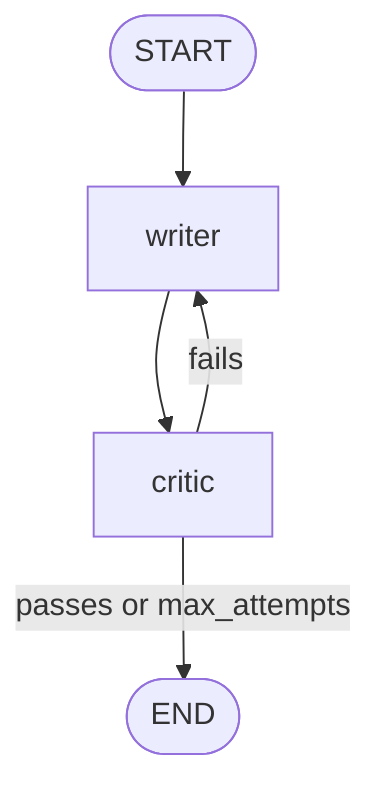

# 02 · Reflect & Retry

A writer drafts a response. A critic evaluates it against explicit criteria. If it fails, the writer rewrites with the critic's feedback. The loop terminates when the draft passes — or when `max_attempts` is hit.



---

## When to use this

- You can **specify quality criteria as text**, not just compare to a ground truth.
- One-shot outputs are inconsistent but you know a good one when you see it.
- You're OK trading **latency and tokens** for quality — this pattern roughly doubles both per retry.

## When *not* to use it

- Criteria can be checked deterministically (regex, schema, unit test). Use a validator loop, not an LLM critic.
- The critic would be the *same model with the same prompt context*. You won't get new signal — you'll get self-agreement.
- Latency budget < 5s. Each retry adds a writer + critic round-trip.

---

## The contract

```python
class State(TypedDict):
    topic: str            # what to write about
    criteria: str         # the bar to clear (in natural language)
    draft: str            # latest attempt
    feedback: str         # critic's feedback on the current draft
    attempts: int         # how many writer calls so far
    max_attempts: int     # hard cap — guarantees termination
    passed: bool          # critic's verdict
```

---

## Tradeoffs

| Choice | Why | Alternative |
|--------|-----|-------------|
| **`max_attempts` hard cap** | Guarantees termination; bounds cost | Unbounded loop → runaway bill |
| **Critic returns structured `Critique`** | `passes` is a real bool, not parsed from text | Free-text critique → brittle |
| **Feedback is injected into the rewrite prompt** | Writer has full context on why it failed | Blind retry → same mistakes |
| **Single critic model** | Simple & cheap | Multi-critic ensemble → higher quality, much higher cost |
| **Criteria passed per invocation** | Caller owns quality bar; graph is reusable | Hard-coded criteria → narrow pattern |

---

## Production notes

- **Use a stronger critic than writer** when cost allows. A weaker critic gives false passes.
- **Log per-attempt state.** The progression from attempt 1 → N is gold for evals and prompt tuning.
- **Detect stuck loops.** If attempts 2 and 3 produce the same feedback, break early — the writer isn't responsive to this critique.
- **Don't over-engineer the critic.** If the critic itself is hallucinating criteria, you're two levels deep. Consider a deterministic validator for the mechanical parts (length, forbidden phrases) and keep the LLM critic for judgment calls.
- **Track pass rate over time.** It's your north-star metric for this pattern.

---

## Run it

```bash
export ANTHROPIC_API_KEY=...
python -m patterns.reflect_retry.example
```
