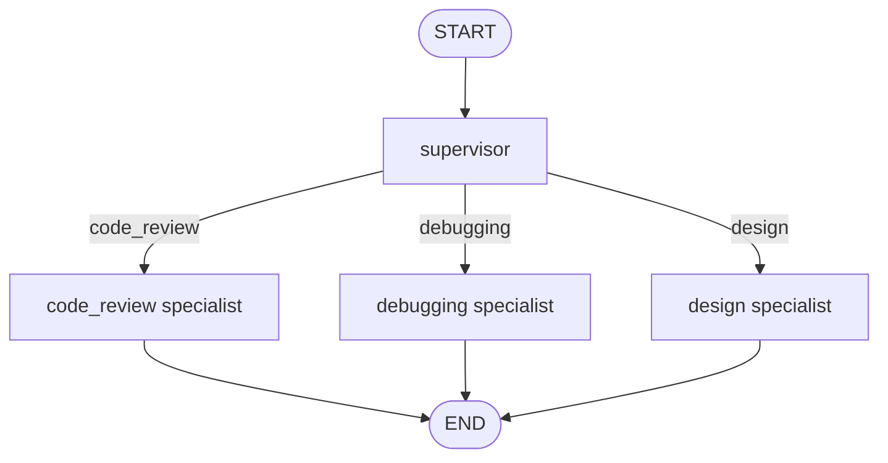

# 01 · Router / Supervisor

A **supervisor** node classifies an incoming request and hands it to the right **specialist**. Each specialist is a leaf here — but each can be a full subgraph, which makes this the foundation of multi-agent systems.



---

## When to use this

- You have one entry point but **multiple downstream behaviors**.
- Handing the whole task to a single general-purpose prompt dilutes quality.
- You want **audit trails**: "which specialist handled this and why?"

## When *not* to use it

- You only have two branches. A `conditional_edge` directly from START is simpler.
- The routing criterion is deterministic (e.g. regex on the input). Just branch in code.
- Specialists need to **collaborate**, not just one-shot the task. You want Plan-Execute or Map-Reduce instead.

---

## The contract

```python
class State(TypedDict):
    question: str           # user input
    route: Specialist | None  # set by supervisor
    route_reason: str | None  # why this route (auditable)
    answer: str | None        # set by the specialist
```

The supervisor writes only `route` and `route_reason`. Specialists write only `answer`. No hidden side effects.

---

## Tradeoffs

| Choice | Why | Alternative |
|--------|-----|-------------|
| **Structured output for routing** (`RouteDecision` Pydantic model) | Deterministic, type-safe dispatch; no parsing regex | Free-text → string match → fragile |
| **Shared `State` TypedDict** across all nodes | One contract, easy to log & trace | Per-node state → harder to compose |
| **`route_reason` field** captured in state | Auditability in production | Drop it → faster but unobservable |
| **`Literal` type for routes** | Type-checker catches drift when adding a specialist | `str` → silent typos in dispatch |

---

## Production notes

- **Log every routing decision.** `route` + `route_reason` are exactly the signals you want in your observability stack.
- **Add a fallback route** (`"unknown"`) when the question doesn't fit any specialist. Don't let the supervisor hallucinate a match.
- **Cache supervisor outputs** for identical inputs during replay/testing — saves cost and makes specialist development deterministic.
- **Guard against route drift:** pin the `Literal` values to an enum and assert in tests that all enum values have a matching node.

---

## Run it

```bash
export ANTHROPIC_API_KEY=...
python -m patterns.router.example
```

## Sample run

```
Q: My React effect runs twice on mount — what's going on?
→ Routed to: debugging
  (The user is experiencing unexpected behavior and needs help diagnosing the root cause.)

Q: Should I use a message bus or direct HTTP calls between my two new services?
→ Routed to: design
  (Architectural trade-offs between two communication patterns — a system design decision.)

Q: Can you review this Python function? `def f(xs): return [x for x in xs if x != None]`
→ Routed to: code_review
  (The user is explicitly asking for a review of existing code quality and style.)
```

Each specialist then produces its full answer. Routing decisions are deterministic thanks to structured output — the `route_reason` makes every dispatch auditable.
