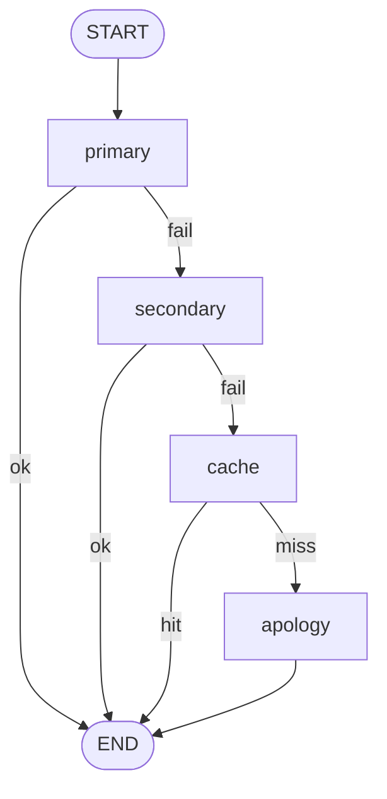

# 08 · Self-Heal

A tiered fallback chain for when tools or model calls fail:

```
primary tool → secondary tool → cached answer → honest apology
```

Each tier is a distinct node. Failures are **visible** in state — nothing silently retries, nothing silently pretends the primary succeeded when the cache served the answer. The user (and your logs) always know which tier responded.



---

## When to use this

- The primary path depends on **external services** that can and will fail.
- A **degraded answer** (cached, from a backup source) is genuinely more useful than an error.
- You need a **clear audit trail** of degradation — which path served which user request.

## When *not* to use it

- Failures are **rare enough** that a simple retry with exponential backoff covers the real-world failure rate.
- There's **no sensible fallback** — bad data is worse than no data for this use case.
- The fallback tiers would hide correctness bugs you actually need to surface loudly in development.

---

## The contract

```python
class State(TypedDict):
    query: str
    attempts: list[str]       # each tier tried + failure reason
    degradation_level: int    # 0=primary, 1=secondary, 2=cache, 3=apology
    response: str
```

`attempts` captures the full path for debugging. `degradation_level` is the single number to alert on.

---

## Tradeoffs

| Choice | Why | Alternative |
|--------|-----|-------------|
| **Tiers as distinct nodes** | Visible in graph + traces; each tier is testable alone | Try/except chain inside one node → opaque failures |
| **Degradation level in state** | Easy to log, alert, and disclose to the user | Silent fallback → users trust a stale answer like a fresh one |
| **Apology as its own node** | Explicit final state; doesn't pretend to answer | Raise exception → caller has to handle; breaks the "always respond" contract |
| **Response text discloses the tier** ("served from cache") | Honest UX; reduces trust debt | Blend tiers into identical-looking output → nicer-looking but misleading |

---

## Production notes

- **Alert on degradation rate, not presence.** Degradation happens; a *spike* means an incident. Track `degradation_level > 0` as a percentage of traffic.
- **Each tier needs its own timeout.** Don't let a slow primary eat the entire request budget before you fall back.
- **Cache sparingly and tag with freshness.** A 6-month-old cached answer delivered with confidence is worse than an apology.
- **Don't retry the same tier inside this graph.** Retry with backoff is a different concern (handle inside the tool); the graph's job is *fallback*, not *retry*.
- **Match disclosure to audience.** End-users get "may be slightly stale"; internal dashboards get the full `attempts` trace. Don't mix them up.
- **Test the apology path.** It's the path you least want to see and the one most likely to have a bug nobody noticed.

---

## Run it

```bash
export ANTHROPIC_API_KEY=...
python -m patterns.self_heal.example
```

## Sample run

Three calls to a deliberately flaky "primary" (90% failure rate) — you'll see the fallback chain exercise different tiers.

```
Q: what is RAG?
→ Served from: primary
→ Path: primary
→ Response: primary-result ... [full LLM answer]

Q: what is RAG?
→ Served from: primary
→ Path: primary
→ Response: primary-result ... [full LLM answer]

Q: what is RAG?
→ Served from: secondary
→ Path: primary → primary-failed: 503 Service Unavailable → secondary
→ Response: secondary-result ...
            (served from secondary source — may be less fresh)
```

When the primary fails, the path in state shows *exactly* what happened: which tier failed, why, and which tier served the answer. The response text is honest about the degradation — the user knows they got a backup answer, not a fresh one.
