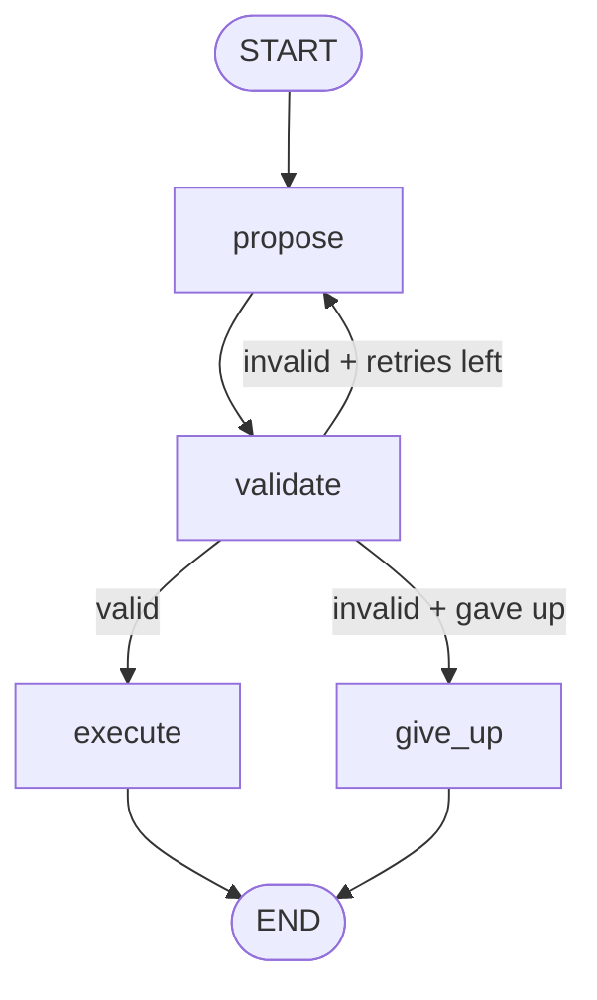

# 07 · Tool Guardrails

Tool calls go through a **validation gate** before execution. The model proposes a structured tool call; a validator runs both schema-level checks (Pydantic) and policy-level checks (explicit business rules). Failed validations loop back with errors the model can fix. Only validated calls reach the tool — so the tool itself never parses untrusted input.



---

## When to use this

- Tools have **real consequences** (DB writes, external API calls, money, prod state).
- Validation is **cheap and declarative** relative to the cost of a wrong call.
- You want the **policy separate from the tool** — new rules shouldn't touch executor code.

## When *not* to use it

- The tool is **purely advisory** (no side effects) and bad input is self-evident to the caller.
- Policy is truly trivial ("non-empty string") — inline validation in the tool is simpler.
- Model provider already enforces the schema at the tool-call boundary and your policy is schema-only. Then Pydantic alone is enough; no retry loop needed.

---

## The contract

```python
class State(TypedDict):
    question: str
    proposed_sql: str
    proposed_reason: str
    validation_errors: list[str]   # empty list = valid
    attempts: int
    max_attempts: int              # hard cap → termination guarantee
    result: str
```

The validator writes `validation_errors` only. The propose node reads them on retry — errors are the *feedback* for the next attempt.

---

## Tradeoffs

| Choice | Why | Alternative |
|--------|-----|-------------|
| **Validator separate from executor** | Policy lives in one place, testable in isolation | Inline validation → policy spread across tools |
| **Structured output at proposal** | Schema violations caught at the boundary | Free-text → fragile parsing + ambiguous errors |
| **Errors as feedback for retry** | Model can correct specific issues | Retry with same prompt → same mistakes |
| **Explicit `max_attempts` + `give_up` node** | Guaranteed termination with a clear failure mode | Uncapped retries → runaway cost on edge cases |
| **Deny-list + allow-list both** | Defense in depth (SELECT-only **and** no mutations) | One or the other → fewer lines, more gaps |

---

## Production notes

- **Validate both shape and policy.** Pydantic catches shape; your rules catch policy. Using only Pydantic is the #1 way tool-call guards get bypassed.
- **Return *why* it failed in errors** — not "invalid query" but "LIMIT exceeds 100." Models can fix specific issues and can't fix vague ones.
- **Log every rejected proposal.** They're training data for your next prompt tweak — and an audit trail when someone asks "did the agent ever try to DROP?"
- **Keep the executor dumb.** If it trusts its input implicitly, your guard has real value. If it also re-validates, you've paid for validation twice.
- **Rate-limit retries per user/session.** A model spinning on an unsatisfiable request shouldn't consume unlimited tokens.
- **Test the validator without the LLM.** Unit tests for guard rules are fast, deterministic, and catch policy regressions without API calls.

---

## Run it

```bash
export ANTHROPIC_API_KEY=...
python -m patterns.tool_guardrails.example
```

## Sample run

Question: *"Who were the top 10 customers by revenue last quarter?"*

```
Attempts: 1

[EXECUTED] SELECT c.customer_id, c.customer_name,
           SUM(o.order_total) AS total_revenue
FROM customers c
JOIN orders o ON c.customer_id = o.customer_id
WHERE o.order_date >= DATE_TRUNC('quarter', CURRENT_DATE - INTERVAL '1 quarter')
  AND o.order_date < DATE_TRUNC('quarter', CURRENT_DATE)
GROUP BY c.customer_id, c.customer_name
ORDER BY total_revenue DESC
LIMIT 10

Rationale: Top 10 customers by revenue last quarter via join +
           date-range filter + aggregation + limit.
(returned: mock 3 rows)
```

Passed on the first attempt — SELECT prefix, no semicolons, no mutation keywords, explicit `LIMIT 10` within cap. The validator is defense in depth: the model usually gets it right, but when it doesn't (prompt injection, edge cases), the guard catches it before the executor touches the database.

Try the demo again with a more ambiguous question and you'll sometimes see `Attempts: 2` — the model proposed something non-compliant, the validator returned specific errors, the rewrite satisfied the policy.
